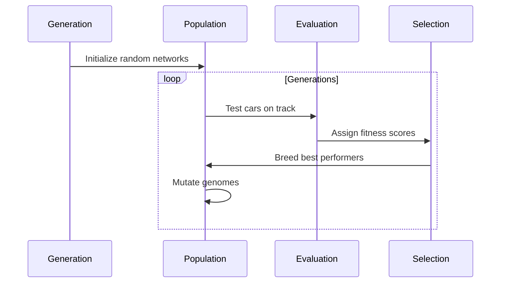

# NEAT Self-Driving Car Simulation

## Overview
This project implements a self-driving car simulation using the **NEAT (NeuroEvolution of Augmenting Topologies)** algorithm, a specialized form of reinforcement learning that combines neural networks with evolutionary algorithms. Cars learn to navigate race tracks through a process of natural selection, where the best-performing neural networks are bred and mutated over generations to create increasingly capable drivers.

## Key Features
- 🧠 **Neuroevolution**: Combines neural networks with genetic algorithms
- 🚗 **Autonomous Driving**: Cars learn from sensor inputs and rewards
- 🏁 **Multiple Tracks**: 4 different race tracks with unique layouts
- 📈 **Real-time Visualization**: Watch evolution in action with PyGame
- 💾 **Automatic Saving**: Models saved every 5 minutes and after each generation
- 📊 **Performance Statistics**: Track fitness, species, and progress

## Understanding NEAT as Reinforcement Learning
NEAT is a specialized reinforcement learning technique that uses evolutionary strategies to train neural networks:

### Core Concepts
1. **Neuroevolution**:
   - Uses genetic algorithms to evolve neural network structures
   - Combines neural network learning with evolutionary biology principles

2. **Reinforcement Learning Framework**:
   ```mermaid
   graph LR
   A[Environment] --> B[Agent]
   B --> C[Actions]
   C --> D[Reward]
   D --> A
   ```
   - **Agent**: Self-driving car with sensors
   - **Environment**: Race track with borders
   - **Actions**: Steering left/right
   - **Reward**: +Fitness for speed/distance, -Fitness for collisions

3. **Genetic Encoding**:
   - Genomes represent neural network structures
   - Each gene encodes a network connection or node

4. **Speciation**:
   - Protects innovative network structures
   - Allows parallel exploration of different solutions

5. **Complexification**:
   - Starts with minimal network structures
   - Adds nodes and connections through mutation

### Why NEAT is Effective for Self-Driving Cars
1. **Handles Partial Observability**: Radar sensors provide limited environment info
2. **Learns Complex Behaviors**: Discovers steering strategies through evolution
3. **Adapts to Environments**: Different tracks require different driving styles
4. **Requires No Pre-labeled Data**: Learns through trial-and-error like human drivers

## Physics and Mathematics

### Car Movement Dynamics
```python
# Velocity vector calculation
self.vel_vector = pygame.math.Vector2(0.8, 0)
self.rect.center += self.vel_vector * 2.5

# Rotation handling
self.vel_vector.rotate_ip(self.rotation_vel)
```

Key equations:
- **Velocity**: `v = Δs/Δt`
- **Rotation**: `new_angle = current_angle ± rotation_velocity`
- **Position update**: 
  ```
  x = x₀ + v·cos(θ)·Δt
  y = y₀ - v·sin(θ)·Δt
  ```

### Sensor System (Radar)
Cars use 4 radar sensors at angles: -60°, -30°, 0°, 30°:
```python
for radar_angle in (-60, -30, 0, 30):
    self.radar(radar_angle)
```

Distance calculation:
```python
dist = math.sqrt((car_x - point_x)**2 + (car_y - point_y)**2)
```

### Neural Network Architecture
| Component       | Specification              |
|-----------------|----------------------------|
| Inputs          | 4 radar distances + speed  |
| Outputs         | Turn left probability      |
|                 | Turn right probability     |
| Activation      | Hyperbolic tangent (tanh)  |
| Hidden Layers   | Evolved through NEAT       |

### Collision Detection
Using color-based boundary detection:
```python
if track_surface.get_at(collision_point) == border_color:
    self.alive = False
```

## Reward System (Fitness Function)
The core reinforcement mechanism:
```python
# Reward for speed (encourage faster driving)
genome.fitness += car.speed * 0.1

# Penalty for crashing (discourage collisions)
genome.fitness -= 10
```

Additional factors:
- **Distance Reward**: `fitness += distance_traveled * 0.01`
- **Survival Bonus**: `fitness += frame_count * 0.001`

## Installation
1. Clone repository:
   ```bash
   https://github.com/marasinibishesh/self_driving_car_NEAT.git
   ```
2. Install dependencies:
   ```bash
   pip install -r requirements.txt
   ```

## Requirements
```txt
pygame
neat-python
numpy
```

## Usage
Run the main script:
```bash
python neat_car_simulation.py
```

**Controls:**
- Select track using the buttons
- Click "Train Model" to start training
- Click "Run Best Model" to see the best performing car
- Press ESC to return to menu during demo

## Training Process
The NEAT reinforcement learning cycle:


## File Structure
```
├── tracks/                # Track images
├── config.txt             # NEAT configuration
├── best_genome_track*.pkl # Saved models per track * Astrik for 1,2,3,4 tracks best model each
├── backups/               # Automatic model backups
├── main4.py # Main simulation code
└── requirements.txt       # Dependencies
```

## Customization
1. **Add New Tracks**:
   - Create PNG images in `tracks/` folder
   - Add entry in `TRACKS` dictionary
2. **Modify Physics**:
   - Adjust `rotation_vel` in Car class
   - Change velocity multiplier
3. **Tune Evolution**:
   - Edit parameters in `config.txt`:
     ```ini
     [NEAT]
     pop_size = 100
     fitness_threshold = 5000
     [DefaultGenome]
     activation_default = tanh
     ```

## Results Interpretation
- **Fitness Graph**: Track learning progress over generations
- **Species Count**: Measure solution diversity (ideal: 5-10 species)
- **Performance Metrics**:
  - Distance traveled before crash
  - Average speed maintained
  - Lap completion (for circular tracks)

## Troubleshooting
| Issue                  | Solution                  |
|------------------------|---------------------------|
| Missing track images   | Create default tracks     |
| Slow performance       | Reduce population size    |
| Cars not learning      | Adjust fitness weights    |
| Stagnant evolution     | Increase mutation rates   |

## Future Enhancements
1. Multi-car racing with competition
2. Traffic and dynamic obstacles
3. Weather and lighting conditions
4. Sensor fusion (camera + radar)
5. Hybrid NEAT + Deep Q-Learning approach

## Acknowledgments
- Kenneth O. Stanley for developing NEAT
- PyGame development community
- NEAT-Python library maintainers
- Reinforcement learning research community

## References
1. Stanley, K. O., & Miikkulainen, R. (2002). Evolving Neural Networks through Augmenting Topologies
2. Sutton, R. S., & Barto, A. G. (2018). Reinforcement Learning: An Introduction
3. Floreano, D., Dürr, P., & Mattiussi, C. (2008). Neuroevolution: from architectures to learning

**License:** MIT
